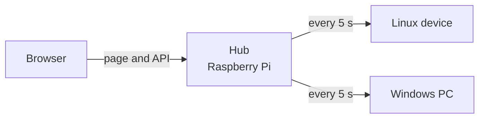

# usage-control

A small website that shows the usage of the hardware it runs on: CPU, memory, disks, network, temperatures, GPU, battery and more, live and as charts over time. It runs on a Raspberry Pi or any Linux machine with Docker or as a service, and on Windows PCs with an installer. One device, the hub, can collect from the others on the network and show them all on one page.

- **Lightweight:** one Go binary serves the page and the API, reads the machine only when asked (every 5 seconds, every 2 while a page is open), and keeps its history in a single SQLite file
- **Local only:** answers only the local network, needs no account and no cloud; the only call outside is an optional daily check for a newer release
- **Read-only:** it only reads hardware data and runs without privileges, in a read-only container or as an unprivileged service
- **Several devices:** a hub polls each device every 5 seconds and keeps all history; Windows PCs only report to it
- **Your router too:** the hub reads its internet traffic over UPnP, and an ASUS router's CPU, memory, Wi-Fi and clients with its login, over the local network only
- **Five languages:** British and American English, German, French and Spanish, switched in place



**[Try the demo](https://chriszly.github.io/usage-control/)**: the real page with made-up Windows and Linux devices, to click through before installing anything. It shows the latest release; the development version from main is at [/main/](https://chriszly.github.io/usage-control/main/).

## Quick start

On a Raspberry Pi or another Linux machine with Docker, in a checkout of this repository:

```bash
docker compose pull
docker compose up -d
```

Then open `http://<the machine's address>:9393` from a device on the same network. To add Windows PCs and other machines, see [Setup](docs/setup.md).

## Intended use

usage-control is meant for monitoring your own devices: machines you own, or machines whose owner and users have allowed you to monitor them. It is not spyware and must not be used as such.

The charts and the availability view show when a device was switched on and how busy it was, which can reveal when and how a person used it. Before you install it on a device someone else uses (family members, flatmates, employees, customers), make sure you are allowed to: tell the people concerned, get their consent where the law requires it, and follow the data protection and workplace rules that apply to you (in the EU the GDPR; in Germany, where there is a works council, monitoring employees also needs its agreement). Installing it secretly on another person's device can be a criminal offence.

You alone are responsible for how and where you use it. usage-control is provided free of charge and "as is", without any warranty, as set out in the [MIT licence](LICENSE); to the extent permitted by law, the authors are not liable for any misuse or for any damage arising from its use.

## Documentation

- [Setup](docs/setup.md): installing the hub and the devices, every setting, updating, troubleshooting
- [How it works](docs/architecture.md): how the hub and the devices talk, with diagrams, and the HTTP API
- [What is collected](docs/data.md): every value, per system, and what is kept in the history
- [Database and history](docs/database.md): the SQLite file, retention, size and backups
- [Development](docs/development.md): code layout, translations, checks and releases

Contributions follow [AGENTS.md](AGENTS.md); security issues go to [SECURITY.md](SECURITY.md).
