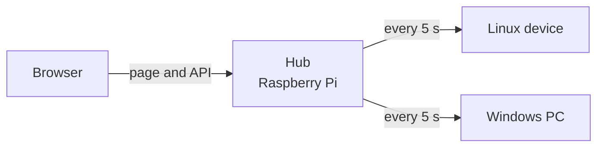

# usage-control

A small website that shows the usage of the hardware it runs on: CPU, memory, disks, network, temperatures, GPU, battery and more, live and as charts over time. It runs on a Raspberry Pi or any Linux machine with Docker or as a service, and on Windows PCs with an installer. One device, the hub, can collect from the others on the network and show them all on one page.

- **Lightweight:** one Go binary serves the page and the API, reads the machine once every 2 seconds while someone looks, and keeps its history in a single SQLite file
- **Local only:** answers only the local network, needs no account and no cloud; the only call outside is an optional daily check for a newer release
- **Read-only:** it only reads hardware data and runs without privileges, in a read-only container or as an unprivileged service
- **Several devices:** a hub polls each device every 5 seconds and keeps all history; Windows PCs only report to it
- **Four languages:** English, German, French and Spanish, switched in place



## Quick start

On a Raspberry Pi or another Linux machine with Docker, in a checkout of this repository:

```bash
docker compose pull
docker compose up -d
```

Then open `http://<the machine's address>:9393` from a device on the same network. To add Windows PCs and other machines, see [Setup](docs/setup.md).

## Documentation

- [Setup](docs/setup.md): installing the hub and the devices, every setting, updating, troubleshooting
- [How it works](docs/architecture.md): how the hub and the devices talk, with diagrams, and the HTTP API
- [What is collected](docs/data.md): every value, per system, and what is kept in the history
- [Database and history](docs/database.md): the SQLite file, retention, size and backups
- [Development](docs/development.md): code layout, translations, checks and releases

Contributions follow [AGENTS.md](AGENTS.md); security issues go to [SECURITY.md](SECURITY.md).
