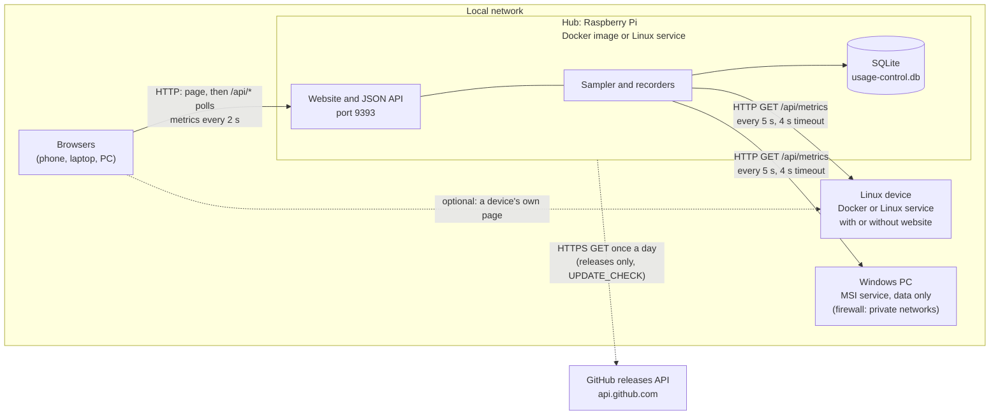
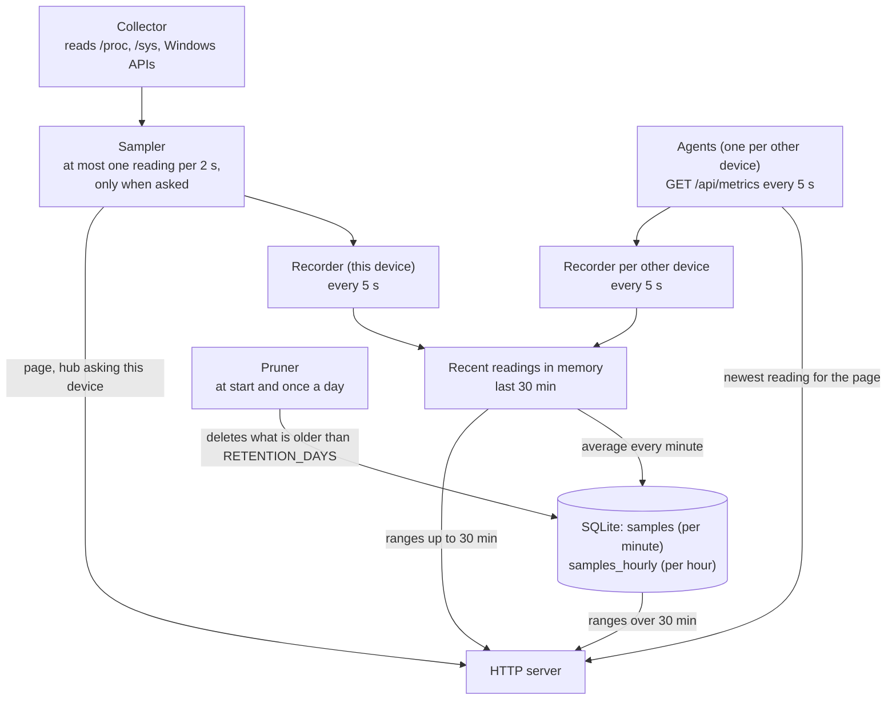
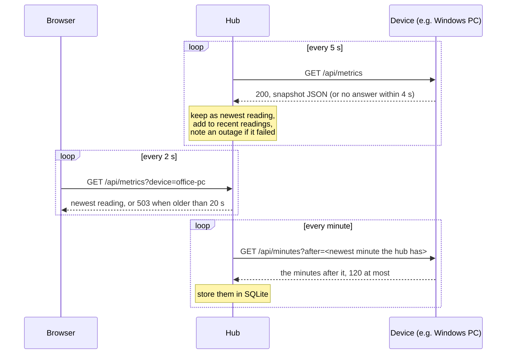

# How it works

usage-control is one program. The same binary runs on every device, and settings decide which role it plays. This page explains the roles, how a hub and its devices talk to each other, what goes over the network and how the website is protected.

- [Roles](#roles)
- [Devices and connections](#devices-and-connections)
- [Inside one device](#inside-one-device)
- [How the hub collects from a device](#how-the-hub-collects-from-a-device)
- [While the hub is away](#while-the-hub-is-away)
- [Availability, usage and outages](#availability-usage-and-outages)
- [Adding and removing devices](#adding-and-removing-devices)
- [How often the page asks](#how-often-the-page-asks)
- [Local network only](#local-network-only)
- [HTTP API](#http-api)

## Roles

| Role | How it is set up | Website | History | Answers |
| --- | --- | --- | --- | --- |
| **Single device** | the default | yes, shows itself | its own, in SQLite | the whole [API](#http-api) |
| **Hub** | a single device with other devices added on the page or in `HUB_DEVICES` | yes, shows itself and every other device | its own and every other device's | the whole API |
| **Data only** | `DATA_ONLY=true`; the default of the Windows installer | no | none, only the minutes the hub has not fetched yet ([while the hub is away](#while-the-hub-is-away)) | only `GET /api/metrics`, `GET /api/minutes`, and `GET /api/hub` on the machine itself |

A hub is a single device that also collects from others. There is no separate hub program or image. Any device that has the website can become a hub by adding a device on its page. A data-only device cannot be a hub: it refuses to start when `HUB_DEVICES` is set as well.

The usual layout is a Raspberry Pi as the hub, running Docker or the Linux service, with Windows PCs installed from the MSI as data-only devices. Other Linux machines can be either: data only, or with their own website, which the hub ignores because it only reads their usage.

## Devices and connections

What goes over the wire:

| From | To | What | How often |
| --- | --- | --- | --- |
| Browser | Hub | the page (`/`, scripts, styles, flags, mascot) | once; hashed files are cached for a year, `index.html` is checked every time |
| Browser | Hub | `GET /api/metrics?device=<id>`: the selected device's current usage | every 2 s |
| Browser | Hub | `GET /api/devices`: the list of devices, with online state | every 5 s |
| Browser | Hub | `GET /api/history?device=<id>&from=…&to=…`: chart data | every 5 s for ranges up to 30 min, every minute up to a day, every 5 min beyond |
| Browser | Hub | `GET /api/availability?device=<id>`: uptime of another device | every 10 s, while one is selected |
| Browser | Hub | `GET /api/update`: running version and newer release | every hour |
| Browser | Hub | `GET /api/devices/suggestion`: the device the page is open on, to fill in the *Devices* dialog | when the dialog opens |
| Browser | Hub | `POST /api/devices`, `DELETE /api/devices/<id>`, `PUT /api/devices/<id>/kind` | when a device is added, removed or its kind changed |
| Hub | The visitor's device | `GET /api/metrics` on port 9393, and a reverse DNS lookup of its address, for its name | when the *Devices* dialog opens |
| Hub | Each device | `GET /api/metrics`: the device's current usage as JSON, a few kilobytes. The `Usage-Control-Hub-Port` header tells the port of the hub's page; the device remembers it with the hub's address | every 5 s |
| Program on the device | The device | `GET /api/hub`: the hub's page as `{"url": "http://192.168.1.20:9393/"}`, empty until a hub asked; only answered to 127.0.0.1 and ::1 | when needed |
| Hub | GitHub | `GET https://api.github.com/repos/Chriszly/usage-control/releases/latest` | once a day, at start and every 24 h after; only on releases, never with `DATA_ONLY` |

The usage, device, availability and chart polls pause while the tab is hidden and read again at once when it is shown. All traffic on the local network is plain HTTP. Nothing else leaves the network: no telemetry, no account, no cloud service. The daily version check only reads the newest release's tag; nothing is downloaded or installed.

Devices never talk to each other or to the browser on their own. Every connection starts from a browser or from the hub.

## Inside one device

- **Collector** reads the machine's usage: one call reads CPU, memory, disks, network, temperatures, GPUs, battery and so on. CPU usage and disk and network speeds are measured against the previous call. See [What is collected](data.md).
- **Sampler** hands the newest reading to everyone who asks: every open page, a hub asking this device, and the recorder. A reading is served again for 2 seconds, so however many pages are open, the machine is read at most once per 2 seconds; it runs no timer of its own, so with no page open it is read only as often as the recorder or a hub asks, every 5 seconds.
- **Recorder** takes a reading every 5 seconds into memory, and every minute stores the average of the last minute in the database. A reading a hub or page asked for less than 4 seconds before is taken instead of reading the machine again. A hub runs one recorder for itself and one per other device; a data-only device runs one that keeps its minutes for the hub (see [While the hub is away](#while-the-hub-is-away)).
- **Pruner** deletes everything older than the retention, once at start and then once a day, for every device at once.

The database is described in [Database and history](database.md).

## How the hub collects from a device

For every other device, the hub runs an **agent** and a **recorder**:

1. Every 5 seconds the recorder asks the agent, and the agent sends `GET http://<address>/api/metrics` to the device.
2. The device answers with its newest reading from its own sampler, as JSON.
3. The agent stamps the reading with the hub's own clock, so a device whose clock is off is still recorded at the right time, and keeps it as the device's newest reading.
4. The recorder adds the reading to the device's recent readings in memory. Every minute it fetches the minutes the device keeps of its own usage (see [While the hub is away](#while-the-hub-is-away)) into the hub's database under the device's id. For a device on a version from before that, it stores the average of its recent readings instead.
5. When a browser shows that device, the hub answers `GET /api/metrics?device=<id>` with the agent's newest reading. The device is never asked once more for each open page.

Rules the agent follows:

- A device has 4 seconds to answer. Answers larger than 1 MiB are not read; a reading is a few kilobytes.
- The agent connects directly, never through a proxy, and does not follow redirects.
- It only connects to addresses on the local network, checked on the address it actually dials, so a host name that resolves to an address outside the network is refused too.
- A device whose newest reading is older than 20 seconds (a few missed readings) counts as unreachable. The page then shows it with a red dot, and its charts get a gap. While it stays unreachable, its charts show the chosen range up to its last reading instead of up to now, with a notice that they are not live; once it answers again, they are live again.
- When the hub itself does not answer the page (no answer at all, or 502/504 from a proxy in front of it), nothing on the page is live, since all values come through the hub. A red banner across the page says so, the hub's button gets a red dot and the other devices a hollow one, as nothing is known about them. The page's usual polls keep asking; the first answer clears the banner.
- The device's id is its name in lower case with dashes, such as `living-room-pi` for *Living room Pi*. The hub's own device is `local`. The history is stored under the id, so renaming a device starts a new history.
- Of each device's disks, temperature sensors, network cards and GPUs, the history keeps the first 64 (`HISTORY_MAX_ENTRIES`), so a misbehaving device cannot fill the hub's database. The live dashboard shows them all.

Collecting uses no extra setting on the devices: retention, history and the charts all live on the hub.

## While the hub is away

When the hub cannot reach a device for a while, because the hub is updated or switched off or the network is down, the device keeps its usage, and the hub fetches it once it reaches the device again. The hub's history then has no gap for the time the device was running.

- Every device keeps the average of each minute of its own usage. A device with a website has them in its history anyway. A data-only device keeps them in a `buffer` table in its database file, for `BUFFER_HOURS` (default 24, at most 168, a week), so they also survive a restart of the device. When that file cannot be opened, the data-only device starts anyway and logs a warning; it then keeps no minutes, and the hub treats it like a device on a version from before this.
- Every minute the hub asks `GET /api/minutes?after=<t>`, with `t` the device's time of the newest minute the hub has. The device answers with the minutes after it, at most 120 per answer, and the hub asks again while more follow, up to 10 answers (20 hours) and 10 seconds per minute, so a week is fetched within a few minutes while the live readings go on.
- Asking with `t` tells the device that the hub has everything up to `t`, so a data-only device deletes those minutes then. Normally that leaves one minute in the buffer, the one the hub fetches next. It deletes only minutes it has handed out before, and refuses a `t` later than its own time, so a request cannot delete minutes no hub has fetched. A device with a website keeps its own history as it is.
- The minutes are moved from the device's clock to the hub's by the difference between the two, measured with each reading. That difference varies by a second or two from one reading to the next, so it is only taken up again once it moved by more than 10 seconds. Minutes the hub has, ones less than half a minute apart, ones in the device's future, and values that are not numbers are left out.
- Every minute is stored at the start of the minute it falls in on the hub's clock, as the recorders store their own averages, and a minute the hub has already is not stored again. So when the hub stored a minute itself and later fetches the device's, the minute is kept once and counted once in its hour.
- When the device's clock goes back, its new minutes are before the ones the hub has. The hub notices from the device's time in its readings and fetches again from its newest minute, at the device's new time.
- A device new to the hub starts with its newest minute, not with what it kept before.
- A device on a version from before this answers `404`. The hub then stores the average of its own readings as before, so that device's history still has a gap while the hub could not reach it, and asks again an hour later, in case the device was updated. Once it is, the hub fetches from its newest minute, the last one it stored itself.
- When the device answers its readings but its minutes cannot be fetched, because it answers with an error or with something that cannot be read, the hub logs it once and stores the average of its own readings for that minute, as for a device from before this. The next minute it tries again from where it stopped, so the minutes the device kept meanwhile still follow; a device minute for a minute the hub stored itself is not stored again. The same happens when the device answers but has kept no minute for over two minutes, as when it cannot write to its disk.
- The 5 second readings of the last 30 minutes are only in the hub's memory and cannot be fetched. A short range with a gap in them is read from the database instead, in 1 minute steps, which has the fetched minutes.
- The time the hub could not reach a device still counts as an outage, or as time not in use, on the [availability](#availability-usage-and-outages) card.
- A device that two hubs collect from hands each minute to the first that asks, so the other gets a gap.

## Availability, usage and outages

For every other device, the hub remembers since when it collects from it and every time the device did not answer:

- An outage starts at the first failed reading and is written to the database right away.
- While it lasts, the page gets its current length from memory. The database copy is updated every 5 minutes, so a crash of the hub loses at most that much of it.
- When the device answers again, the outage's end is written.

The *Availability* card shows the share of time the device answered since it was added, the total time offline, how many outages there were and the last one. Time the hub itself was not running is not counted, since the hub cannot know about it. Outages are kept as long as the device is, not only for the retention.

What a time without an answer means depends on the device's kind, picked in the *Devices* dialog and stored in `hub_device_kinds`:

| Kind | Time without an answer | Card | Device button |
| --- | --- | --- | --- |
| *Server / IoT* (the default, also for `HUB_DEVICES` and devices added before kinds existed) | an outage | *Availability* | red dot, warning above the cards |
| *PC / laptop* | the PC was switched off or asleep | *Usage*: share of time it was on, how long and how often it was off | grey dot, a neutral note instead of the warning |

The hub records both kinds the same way, so changing the kind later only changes how the times already recorded are shown.

Removing a device on the page deletes its availability and kind, and its history unless *Keep its history* is ticked. A device taken out of `HUB_DEVICES` loses its availability and kind at the next start; its history stays until it ages out.

## Adding and removing devices

The *Devices* button on the hub's page opens a dialog that lists every device. Devices added there are stored in the hub's database (`hub_devices`) and are collected from right away, with no restart. Devices from `HUB_DEVICES` show as *Set in .env* and can only be removed there. The kind of every device, those from `HUB_DEVICES` too, can be changed in the list (`PUT /api/devices/<id>/kind`).

When the dialog opens, it fills in the form with the device the page is open on, unless the hub already collects from it:

1. The page sends `GET /api/devices/suggestion`. The hub takes the address the request came from, not a header.
2. It offers nothing for its own addresses (in Docker also the host's network cards, which its usage lists), loopback, link-local IPv6 and its default gateway. Behind Docker's port publishing, a request can arrive from the Docker network's gateway instead of the visitor; that is the container's default gateway, so it is never offered. It offers nothing either when a device's address is that IP with port 9393, or a name that resolves to it with port 9393.
3. For the name, it asks a usage-control on that address at port 9393 for `/api/metrics`, whose `name` is the device's `DEVICE_NAME` or hostname, and at the same time looks the address up in the DNS (the router usually knows the names of its DHCP clients), using the first part of the name, such as `office-pc` for `office-pc.fritz.box`. Both are given 2 seconds. A device that calls itself by the name of a device already added is not offered.
4. It answers `{ address, name, kind }` with the address as `<ip>:9393` the name empty when neither lookup found one, and the kind `pc` when the device reports a battery or no load average (Windows), else `server`, or `204` when there is nothing to offer. Nothing is typed over: a suggestion arriving after the visitor started typing is dropped.

Adding a device:

1. The page sends `POST /api/devices` with the name, the address (`host:port`), the kind (`server` or `pc`) and the password.
2. The hub checks the name (1 to 64 characters, at least one letter or digit, not taken) and the address (a host name, IPv4 address or bracketed IPv6 address, and a port; nothing else, since it becomes part of a URL). An address and port that another device already has is refused, also when written differently, such as an IPv4-mapped IPv6 address or a name in other case; host names are not looked up. The same IP address with another port is another device, since each port can run its own usage-control. `HUB_DEVICES` refuses to start with the same address and port twice.
3. It asks the address once for `/api/metrics`. Only when a usage-control answers is the device stored and the recording started.

Every change asks for a password:

- The first change chooses it: at least 8 characters, typed twice in the dialog. The password is stored only when that change works.
- From then on every add, remove or change of kind needs it. It cannot be changed on the page.
- Only a salt and a PBKDF2-SHA256 hash (600,000 iterations) are stored, in the `password` table. Each wrong password is answered one second late, and checks run one at a time, so guessing over the network is slow.
- If it is forgotten, `RESET_PASSWORD=true` deletes it at the next start; the next change chooses a new one. Unset it right after, or every restart deletes it again.

The requests must be `application/json`. A browser does not send JSON to another site without asking that site first, and usage-control never allows it, so another web page cannot add or remove devices. The site runs on plain HTTP on the local network, so the password guards against accidental changes by people on the network, not against someone who can read its traffic.

## How often the page asks

| What | Interval | Notes |
| --- | --- | --- |
| Current usage (dashboard) | 2 s | matches the sampler |
| Device list and online dots | 5 s | |
| Availability or Usage card | 10 s | only for another device |
| Charts, up to 30 min | 5 s | from memory |
| Charts, up to a day | 1 min | from the database, per minute |
| Charts, longer | 5 min | from the hourly averages |
| New version notice | 1 h | |

A poll that is still waiting for its answer skips the next tick instead of piling up requests. All polls but the version notice pause while the tab is hidden.

## Local network only

The website and the API answer only the local network. Every request passes three checks before any handler runs:

1. **The client's address**, from the TCP connection (not a header a client could fake), must be loopback, private (RFC 1918, IPv6 unique local), link-local, or a global IPv6 address in one of the machine's own subnets (home networks with IPv6 from the provider use those). Otherwise: `403 Forbidden`.
2. **The Host header** must be a name the device knows: an IP address, `localhost`, its hostname, any `.local` name, or a name in `ALLOWED_HOSTS`. Otherwise: `421 Misdirected Request`. This stops DNS rebinding, where a web page from the internet points its own domain at the device's LAN address to read the API through a browser on the LAN.
3. Responses carry `X-Content-Type-Options: nosniff`, and the website is served without directory listings.

The hub applies the same address check to its outgoing connections. In Docker, the port is published over IPv4 only (`0.0.0.0:9393`): Docker's proxy would hand IPv6 connections over from its own internal address, which hides the real client.

## HTTP API

All answers are JSON with `Cache-Control: no-store`. Times in the history are Unix seconds; other times are RFC 3339 in UTC. `?device=<id>` picks a device from `GET /api/devices`; without it the API answers for the device it runs on.

| Method and path | Answers | Errors |
| --- | --- | --- |
| `GET /api/metrics[?device=<id>]` | the device's current usage: version, time, time zone, uptime, CPU, memory, temperatures, disks, network, GPUs, throttling, battery, fans, extras ([fields](data.md#the-snapshot)) | `404` unknown device, `503` another device that has not answered recently |
| `GET /api/devices` | `{ devices: [{ id, name, address, kind, removable, unreachable, unreachableSince }], passwordSet }` | |
| `GET /api/devices/suggestion` | `{ address, name, kind }`: the device the request came from, to offer adding it; see [Adding and removing devices](#adding-and-removing-devices) | `204` when there is none to offer |
| `POST /api/devices` | body `{ name, address, kind, password }`, `kind` `server` (when left out) or `pc`; `201` with the new device | `400` name, address, kind or password length, `403` wrong password, `409` name or address and port taken, `415` not JSON, `422` nothing answers at the address |
| `DELETE /api/devices/<id>` | body `{ password, keepHistory }`; `204` | `403` wrong password, `404` unknown device, `409` set in `HUB_DEVICES` |
| `PUT /api/devices/<id>/kind` | body `{ kind, password }`; `204` | `400` kind, `403` wrong password, `404` unknown device |
| `GET /api/history?from=<s>&to=<s>[&device=<id>]` | `{ from, to, stepSeconds, retentionDays, series: [{ metric, points: [{ time, value }] }], lastReading?, extras? }`, at most 360 points per metric. `extras` describes the series of [extras](data.md#extras) by metric. For an unreachable device, `lastReading` is the time of its newest reading, and a range ending later is moved back to end there, keeping its length | `400` when `from` and `to` are not Unix seconds with `from` before `to` |
| `GET /api/availability?device=<id>` | `{ kind, since, offlineSeconds, outages, lastOutage: { start, end } }` | `404` for the device the hub runs on |
| `GET /api/update` | `{ current, latest, url }`; `latest` and `url` only when a newer release exists | |
| `GET /api/hub` | `{ url }`: the page of the hub that last asked this device for its usage, empty until one did | `403` from anywhere but this machine |
| `GET /api/minutes?after=<s>` | `{ now, minutes: [{ time, values: { <metric>: <value> } }], more }`: the device's own minutes after `after`, at most 120, on its clock; see [While the hub is away](#while-the-hub-is-away) | `400` when `after` is not Unix seconds or is later than the device's time |

A refused change answers with `{ problem, message }`: `problem` is a code the page translates (`name`, `nameTaken`, `address`, `unreachable`, `notFound`, `fixed`, `passwordLength`, `wrongPassword`, `request`), and `message` explains it in English.

A data-only device answers only `GET /api/metrics`, `GET /api/minutes` and `GET /api/hub`.
