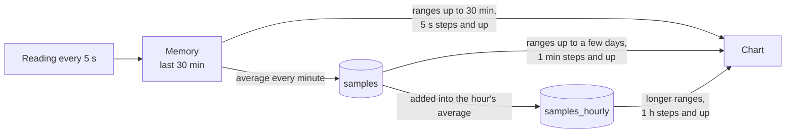

# Database and history

Every device with a website keeps its history in one SQLite file. A hub keeps the history of every device it collects from in its own file. A data-only device keeps no history, only the minutes the hub has not fetched yet, in a `buffer` table in the same kind of file, with how far each hub has fetched them in `buffer_hubs` and how its extras are described in `buffer_extra_info`, and no other table (see [While the hub is away](architecture.md#while-the-hub-is-away)).

- [Where the file is](#where-the-file-is)
- [Tables](#tables)
- [From reading to chart](#from-reading-to-chart)
- [Retention](#retention)
- [Size](#size)
- [Updates to the layout](#updates-to-the-layout)
- [Backups](#backups)

## Where the file is

| Install | File |
| --- | --- |
| Docker | `/data/usage-control.db` in the container, on the `data` volume, so it survives updates and recreated containers |
| Linux service | `/var/lib/usage-control/usage-control.db` |
| Windows | `C:\ProgramData\Usage Control\usage-control.db`; uninstalling keeps it |
| From source | `usage-control.db` in the folder the program was started from |

`DATABASE_PATH` moves it. The driver is a pure-Go SQLite, so the binary needs no C library. The file uses write-ahead logging (WAL), so the page can read while the recorders write; next to it you will see `usage-control.db-wal` and `usage-control.db-shm`, which belong to it.

## Tables

| Table | Holds | Kept |
| --- | --- | --- |
| `samples` | one row per device, minute and metric: `device`, `time` (Unix seconds), `metric`, `value` | for the retention |
| `samples_hourly` | the average of each hour per device and metric, with `count`, how many minute values it is over | for the retention |
| `extra_info` | how each stored [extra](data.md#extras) is described: `device`, `metric`, `info` (title, label and unit as JSON), `written` (Unix seconds) | while the extra has values, or for the retention after it was last written |
| `hub_devices` | devices added on the page: `id`, `name`, `address`, `added` | until removed on the page |
| `buffer` | data-only devices: one row per minute and metric of the device's own usage, `time`, `metric`, `value` | until every hub has fetched it, at most `BUFFER_HOURS` |
| `buffer_hubs` | data-only devices: per hub, by the id it sends (so a hub whose address changes, as with IPv6 privacy addresses, keeps one row), `fetched`, the newest minute it has, `sent`, the newest handed to it, and `asked`, when it last asked (Unix seconds) | while it is one of the 16 hubs that asked most recently |
| `buffer_extra_info` | data-only devices: how each of its own [extras](data.md#extras) is described, as `extra_info` without `device` | for `BUFFER_HOURS` after it was last written |
| `hub_watched` | per other device, since when the hub collects from it | as long as the device is collected from |
| `hub_outages` | per other device, every time it did not answer: `started`, `ended` (Unix milliseconds) | as long as the device is collected from |
| `hub_id` | the hub's own id, which it sends to every device, so a device that keeps its minutes for the hub tells it apart from other hubs; made at random once | for good |
| `hub_device_kinds` | per other device that is a PC or laptop: `device`, `kind` (`pc`); a device without a row is a server or IoT device | as long as the device is collected from |
| `password` | the salt and PBKDF2-SHA256 hash of the password for changing devices, one row at most | until `RESET_PASSWORD=true` |

`samples` and `samples_hourly` use `(device, time, metric)` as the key, stored without a separate row id, plus an index by time for deleting old rows. The metric names are listed in [What is kept in the history](data.md#what-is-kept-in-the-history). A new metric or a new device needs no change to the tables. Devices from `HUB_DEVICES` are not stored; they are read from the setting at every start. Their kind is stored, though, which is why it is a table of its own rather than a column of `hub_devices`; it also needs no migration, since a database without the table holds servers only.

## From reading to chart



**Writing.** Each device's recorder takes a reading every 5 seconds and keeps the readings of the last 30 minutes in memory. Every minute, at its 55th second (a hub's recorder of another device at second 5 of the next minute, see [While the hub is away](architecture.md#while-the-hub-is-away)), it writes their average to `samples`, at the start of that minute, and, in the same transaction, adds it into the running average of the hour in `samples_hourly`. A minute that is in `samples` already, as when a hub stored a minute itself and later fetches the device's, is not written again, so it counts once in its hour. One write per device per minute keeps the SD card of a Raspberry Pi from wearing out. The first reading after a start is not kept, since its CPU usage is the average since the machine booted.

**Reading.** The page opens on the last 30 minutes. A chart asks for a range and gets at most 360 points per metric, each the average over one step:

- Ranges up to 30 minutes come from memory, in steps of 5 seconds or more.
- Longer ranges come from `samples`, in steps of whole minutes.
- As soon as a step is an hour or more (ranges over 15 days), they come from `samples_hourly`, weighted by `count`, which gives the same averages from 60 times fewer rows.
- Where memory has a gap of a few missed readings, as after the hub could not reach a device, or does not reach back far enough yet, as after a restart, only the steps of the gap come from the database: each gets the value of its minute there, such as one the hub fetched from the device since. The rest of the range still comes from memory. A minute is stored at its start but averages the readings of the minute before it was stored, so a step right next to a gap can show a value up to about a minute older than its time; it only shapes how the gap is drawn. A short range with no reading in memory at all comes from the database in 1-minute steps, so the chart is never empty.
- Database answers are kept for up to a minute per device and step, so every open tab and every viewer of the hub share one query.

A device that did not answer has no values for that time, which shows as a gap in its chart. While a device does not answer, a range that ends after its newest reading is moved back to end there, keeping its length, so its charts show the last data there is instead of an empty range. The newest reading comes from memory, or after a restart from `samples` (one row of the primary key's index).

## Retention

`RETENTION_DAYS` (default 30, from 1 to 3650) sets how long values are kept, for every device on the hub alike. Once at start and then once a day, everything older is deleted from `samples` and `samples_hourly`. It is deleted 5,000 rows at a time, each in a transaction of its own, so a large cleanup (the first after a long downtime, or after shortening `RETENTION_DAYS`) never keeps the recorders from storing for long; afterwards the write-ahead log is shrunk back. The API never returns values older than the retention, so values waiting for the next cleanup are not shown. When more is kept than the longest range the page offers within it (for example 10 days, where the longest is 7 days), the page also offers an *All* range.

Changing `RETENTION_DAYS` takes effect at the next start. Shortening it deletes the older values then; lengthening it cannot bring back what was already deleted.

Outages and the list of devices are not bound to the retention: they are kept as long as the device is.

## Size

Each kept value is one row per minute plus one per hour. As a guide, measured with a SQLite file filled like a Raspberry Pi's history (15 values per minute: CPU, memory, swap, two temperatures, one disk with read and write, three network cards, GPU):

| Values per device | Per day | 30 days | 365 days |
| --- | --- | --- | --- |
| 15 (a Raspberry Pi) | about 1.5 MB | about 45 MB | about 550 MB |
| 30 (a PC with more disks and cards) | about 3 MB | about 90 MB | about 1.1 GB |

A hub's file is the sum over its devices. A data-only device's buffer holds only minutes, no hours, and normally just one; while the hub cannot reach it, it grows by a little less than a history's day per day, up to `BUFFER_HOURS`: about 3 MB for a PC's 24 hours, about 20 MB for a week. `HISTORY_MAX_ENTRIES` (default 64) caps how many disks, sensors, network cards and GPUs each a device can add, and how many groups of extras and values per group, so one device with hundreds of virtual network cards cannot fill the disk. Each extra with `history: true` counts as one more value per device, at most 8 × `HISTORY_MAX_ENTRIES` (512) of them, and metric names are at most 256 bytes long.

Deleted rows leave free pages in the file, which SQLite reuses for new values; the file does not shrink on its own. The write-ahead log (`usage-control.db-wal`) does: after a cleanup that deleted more than 5,000 rows it is truncated.

## Updates to the layout

The file's layout version is kept in SQLite's `user_version`. When a new version of usage-control changes the layout:

1. It copies the file to `usage-control.db.backup` next to it, replacing an older copy.
2. It updates the file in one transaction.

An older version refuses to start on a file a newer version has changed, instead of damaging it, and says so in its log. To go back, put the old version and the `.backup` copy in place.

| Version | Change |
| --- | --- |
| 1 | the first layout: `samples`, plus the hub and password tables created when first used |
| 2 | adds `samples_hourly` and fills it from the values already kept |

## Backups

The file holds everything a device keeps: history, added devices, outages and the password hash. To back it up, copy it while usage-control is stopped, or use SQLite's `.backup` command while it runs. With Docker:

```bash
docker compose stop
docker run --rm -v usage-control_data:/data -v "$PWD":/backup alpine cp /data/usage-control.db /backup/
docker compose start
```

The volume's name is the folder of `compose.yaml` followed by `_data`; `docker volume ls` lists it.
